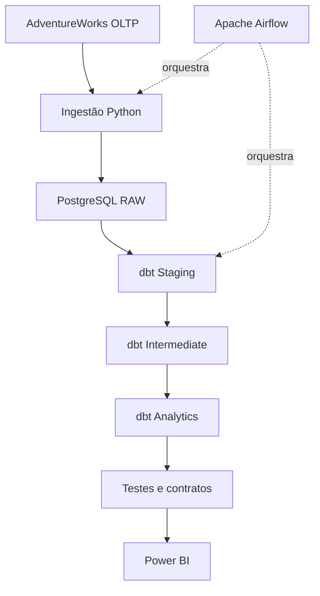
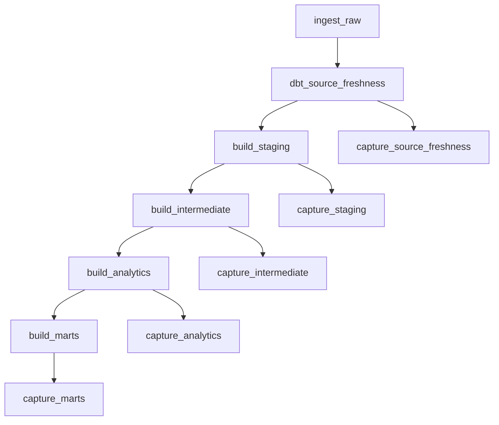
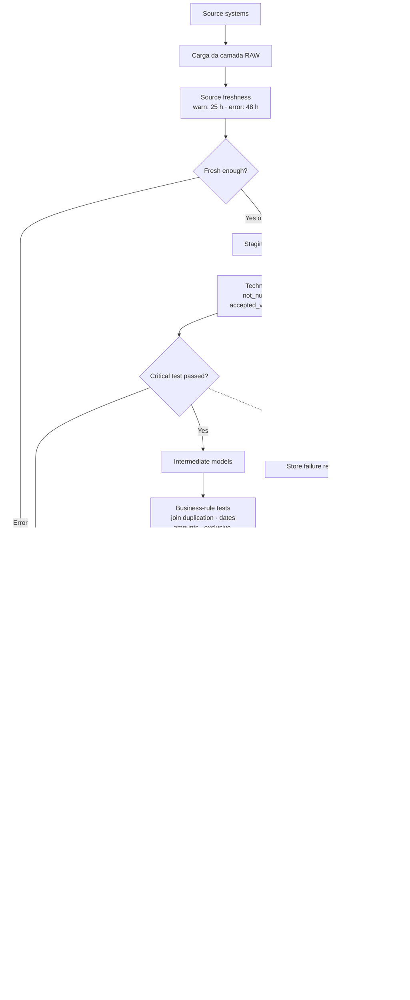
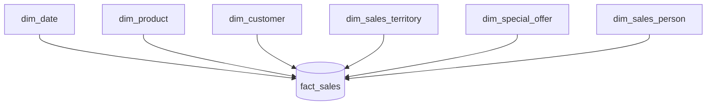

# Modern Data Platform — Adventure Works

Plataforma analítica desenvolvida como projeto de portfólio para demonstrar, de ponta a ponta, práticas de Engenharia de Dados, Analytics Engineering e Business Intelligence.

O projeto transforma dados operacionais do Adventure Works em modelos analíticos confiáveis, documentados e preparados para consumo por ferramentas de BI.

## Visão geral

O cenário simula uma empresa que depende diretamente de um banco transacional para produzir relatórios. Essa abordagem gera consultas lentas, métricas inconsistentes e forte dependência da estrutura operacional.

A solução proposta separa processamento operacional e consumo analítico por meio de uma plataforma que contempla:

- ingestão de dados;
- armazenamento em camada `raw`;
- transformação com dbt;
- modelagem dimensional;
- testes automatizados de dados;
- documentação e lineage;
- exposure do dashboard de vendas no Power BI;
- modelos orientados ao consumo;
- orquestração com Apache Airflow;
- histórico de testes e falhas para observabilidade;
- visualização no Power BI.

## Estado atual

A primeira versão da camada analítica de vendas está concluída e validada.

| Entrega | Situação |
| --- | --- |
| PostgreSQL e dados do Adventure Works | Concluído |
| Camadas `staging` e `intermediate` | Concluído |
| Modelo dimensional de vendas | Concluído |
| Contratos e testes dbt | Concluído |
| Catálogo e lineage do dbt | Concluído |
| Mart de detalhes de vendas | Concluído |
| Orquestração com Airflow | Concluído |
| Backend de observabilidade dbt | Concluído |
| Dashboard de vendas no Power BI | Em Andamento |

## Arquitetura



## Princípios arquiteturais e avaliação atual

As decisões da plataforma seguem princípios arquiteturais proporcionais ao
estágio e à escala do projeto. A avaliação abaixo registra tanto os pontos já
atendidos quanto as lacunas conhecidas, sem introduzir complexidade que o
cenário atual não exige.

| # | Princípio | Avaliação atual | Justificativa |
| --- | --- | --- | --- |
| 1 | Componentes comuns | Atendido | GitHub, Airflow, dbt, PostgreSQL e os padrões de camadas são compartilhados por todo o projeto. |
| 2 | Planejar para falhas | Parcialmente atendido | Há testes, freshness, retries automáticos, bloqueio do pipeline e preservação de evidências. Ainda faltam alertas, runbooks e uma estratégia documentada de recuperação. |
| 3 | Escalabilidade | Atendido para a escala atual | PostgreSQL e cargas em lote atendem ao volume atual; a arquitetura não precisa escalar além do problema existente. |
| 4 | Arquitetura como liderança | Parcialmente atendido | Decisões, trade-offs e padrões são documentados para que possam ser compreendidos, avaliados e reutilizados por outras pessoas. |
| 5 | Arquitetura contínua | Atendido | A arquitetura é revisada de forma incremental, com lacunas identificadas e evoluções registradas no roadmap. |
| 6 | Baixo acoplamento | Parcialmente atendido | Ingestão, transformação, orquestração e consumo estão separados, mas a ingestão ainda é específica para PostgreSQL e recria a camada `raw`. |
| 7 | Decisões reversíveis | Parcialmente atendido | Git, Docker, camadas separadas e regras centralizadas no dbt favorecem mudanças. A dependência de PostgreSQL e de SQL específico exigiria adaptação em uma migração. |
| 8 | Segurança | Documentado; sem implementação necessária agora | O dataset é público e não contém dados pessoais reais. Em produção, campos classificados como PII seriam identificados e protegidos por mascaramento, remoção ou controle de acesso. Credenciais devem permanecer fora do versionamento. |
| 9 | FinOps | Não aplicável operacionalmente no momento | A execução é local e não gera custos de nuvem a monitorar. O princípio passa a ser relevante na avaliação de alternativas como PostgreSQL e Snowflake. |
| 10 | Confiabilidade | Adequada ao escopo atual | Health checks, retries e bloqueios reduzem falhas transitórias. Alta disponibilidade e failover não são necessários para este ambiente local de demonstração e adicionariam complexidade desproporcional. |
| 11 | Durabilidade | Parcialmente atendida | Volumes persistentes preservam os bancos entre reinicializações dos containers, mas não substituem backup. Está planejado o uso do MinIO para manter os arquivos brutos em armazenamento de objetos e permitir reprocessamento independente do banco. |

A principal lacuna prática está no planejamento para falhas: alertas,
procedimentos de resposta a incidentes e recuperação devem ser tratados como
evoluções futuras. Os demais pontos pendentes são, neste estágio,
principalmente oportunidades de documentação e desacoplamento gradual.

## Stack tecnológica

| Área | Tecnologia |
| --- | --- |
| Banco de dados | PostgreSQL |
| Transformação | dbt |
| Linguagens | SQL e Python |
| Containerização | Docker e Docker Compose |
| Orquestração | Apache Airflow |
| Visualização | Power BI |
| Versionamento | Git e GitHub |
| Documentação | Markdown, Mermaid e dbt Docs |

# Orquestração com Apache Airflow

O Apache Airflow coordena a execução do pipeline por meio da DAG `adventureworks_pipeline`.

O fluxo possui onze tarefas: ingestão, freshness, quatro gates de transformação
e cinco capturas de observabilidade.



- `ingest_raw`: executa o script Python responsável pela carga da camada RAW;
- `dbt_source_freshness`: verifica freshness técnica e de negócio; gera aviso
  após 25 horas e erro após 48 horas;
- `capture_source_freshness`: persiste o conteúdo de `sources.json`, inclusive
  quando a freshness falha e bloqueia o build;
- `build_staging`: constrói e testa os modelos de padronização das sources;
- `build_intermediate`: constrói e testa as transformações reutilizáveis;
- `build_analytics`: constrói e testa fatos e dimensões, sem incluir marts;
- `build_marts`: constrói e testa os modelos destinados ao consumo;
- `capture_staging`, `capture_intermediate`, `capture_analytics` e
  `capture_marts`: persistem os resultados e registros inválidos dos artefatos
  gerados por cada camada;
- cada tarefa de processamento somente começa quando a anterior termina com
  sucesso;
- novas tentativas são executadas automaticamente em caso de falha.

Quando a freshness atinge `error`, `dbt_source_freshness` falha e o
`build_staging` não é executado. Um resultado `warn` não bloqueia o restante
do pipeline. Nos dois casos, `capture_source_freshness` registra o resultado
para investigação.

Todas as tarefas de captura usam `trigger_rule="all_done"`. Assim, a captura de
uma camada ocorre mesmo quando um teste daquele gate reprova. A falha original
continua marcando a DAG como reprovada e impede as camadas posteriores,
enquanto as evidências da camada que falhou são preservadas para investigação.

Cada comando `dbt build` utiliza um diretório de artefatos próprio:

| Gate | Seleção dbt | Diretório de artefatos |
| --- | --- | --- |
| Staging | `path:models/staging` | `staging/` |
| Intermediate | `path:models/intermediate` | `intermediate/` |
| Analytics | `path:models/analytics --exclude mart_sales_details` | `analytics/` |
| Marts | `mart_sales_details` | `marts/` |

Essa separação evita que `run_results.json` e `manifest.json` sejam
sobrescritos entre os gates e permite identificar duração, status e falhas por
camada no Airflow e no histórico de observabilidade.

Os comandos usam `--indirect-selection buildable`. Dessa forma, cada gate
executa os testes cujas dependências pertencem à camada atual ou a camadas já
construídas, sem antecipar testes que dependem de modelos downstream.

### Freshness técnica e de negócio

A freshness possui duas interpretações complementares:

- `salesorderheader` e `salesorderdetail` usam `modifieddate`. Essas tabelas
  representam eventos transacionais e devem receber alterações diariamente;
  portanto, o teste mede a idade do último evento de negócio disponível;
- as tabelas cadastrais usam `_loaded_at`. Como clientes, produtos e demais
  cadastros podem permanecer válidos sem sofrer alterações diárias, o teste
  confirma que a extração e a carga no warehouse foram executadas recentemente.

Essa separação evita considerar uma tabela transacional atualizada apenas
porque ela foi recarregada e também evita falsos alarmes em dimensões que não
precisam receber novos registros todos os dias.

Nas tabelas transacionais, um campo como `_build_at` ou `_loaded_at` gerado
pelo próprio pipeline não seria adequado para medir atividade de negócio: ele
seria renovado sempre que a carga ou o build executasse, mesmo que a origem não
tivesse recebido pedidos ou alterações. `modifieddate` foi escolhido porque
representa a inclusão ou a alteração mais recente registrada no sistema de
origem. `orderdate` poderia medir exclusivamente a chegada de novos pedidos,
mas não capturaria atualizações em pedidos existentes.

## Fluxo de qualidade e bloqueios

O desenho abaixo representa o fluxo de qualidade pretendido e sua relação com
o que está implementado atualmente:



O `dbt build` respeita o lineage dos modelos. Um teste com severidade de erro
impede a execução dos recursos que dependem daquele ponto do grafo; por isso,
uma falha em `staging` pode impedir modelos `intermediate`, e uma falha nesses
modelos pode impedir fatos, dimensões e marts dependentes.

Os testes técnicos validam preenchimento, unicidade, relacionamentos, valores
aceitos e contratos. Os testes singulares cobrem regras de negócio e
reconciliações financeiras. Seus resultados são lidos de `run_results.json` e
`manifest.json`; quando `store_failures=true`, os registros inválidos também
são persistidos em `observability.dbt_test_failure_details`.

O fluxo ainda não implementa quarentena física de registros, envio automático
de alertas nem uma classificação formal de testes não críticos com
`severity: warn`. Esses itens aparecem no diagrama como evolução futura. Hoje,
qualquer teste configurado com a severidade padrão `error` bloqueia seus nós
dependentes.

## Observabilidade dos testes dbt

Os testes singulares armazenam as linhas inválidas com `store_failures=true`.
Depois do build, o script `python/observability/load_dbt_artifacts.py` lê
`run_results.json` e `manifest.json` e grava o histórico no PostgreSQL.

| Tabela | Grão |
| --- | --- |
| `observability.dbt_runs` | Uma linha por execução do dbt |
| `observability.dbt_test_results` | Uma linha por teste e execução |
| `observability.dbt_test_failure_details` | Uma linha por registro inválido capturado |
| `observability.source_freshness_runs` | Uma linha por execução de freshness |
| `observability.source_freshness_results` | Uma linha por source e execução de freshness |

Essa separação permite acompanhar execuções aprovadas e reprovadas sem
confundir metadados de execução com os detalhes das falhas. As tabelas formam a
base para alertas e para um futuro dashboard de observabilidade no Power BI.

### Ownership

Todos os modelos pertencem ao grupo dbt `sales_analytics`, que identifica o
responsável técnico pelo domínio. O carregador resolve o owner de cada teste a
partir do lineage registrado no `manifest.json` e adiciona grupo, nome e e-mail
à tabela `observability.dbt_test_results`.

Com isso, uma falha deixa de informar apenas qual teste quebrou: ela também
indica quem deve ser acionado. A mesma informação poderá alimentar filtros no
dashboard e notificações direcionadas pelo Airflow.

Inicialmente, a DAG utiliza execução manual (`schedule=None`) para facilitar a validação do pipeline.

## Componentes do Airflow

A infraestrutura utiliza:

- API Server e interface web;
- Scheduler;
- DAG Processor;
- LocalExecutor;
- PostgreSQL exclusivo para metadados;
- Docker Compose para execução local.

## Executando o pipeline

Construa as imagens:

```bash
docker compose build
```

Inicialize o banco de metadados e o usuário administrador:

```bash
docker compose up airflow-init
```

Suba os serviços:

```bash
docker compose up -d
```

A interface estará disponível em:

```text
http://localhost:8080
```

Credenciais locais de desenvolvimento:

```text
Usuário: airflow
Senha: airflow
```

Na interface, ative e execute a DAG `adventureworks_pipeline`.

## Estrutura do projeto

```text
modern-data-platform/
├── airflow/                  # DAGs e configurações de orquestração
├── database/                 # Scripts e recursos do banco de dados
├── dbt/
│   └── adventure_works/
│       ├── models/
│       │   ├── staging/      # Padronização das fontes
│       │   ├── intermediate/ # Regras e combinações reutilizáveis
│       │   └── analytics/    # Fatos, dimensões e marts
│       └── tests/            # Testes singulares de negócio
├── docker/                   # Recursos de containerização
├── docs/                     # Documentação complementar
├── powerbi/                  # Artefatos do Power BI
├── python/                   # Ingestão e simulação de dados
├── docker-compose.yml
└── README.md
```

> A estrutura pode evoluir conforme as próximas etapas forem implementadas.

## Camadas de transformação

### Staging

A camada `staging` cria uma interface padronizada sobre as tabelas de origem. Nela são realizados ajustes como:

- renomeação de colunas;
- conversão de tipos;
- padronização de valores;
- inclusão de metadados de carga;
- testes básicos de qualidade.

Os modelos usam o prefixo `stg_` e são materializados como `view`.

### Intermediate

A camada `intermediate` concentra transformações reutilizáveis e combinações que não devem ficar diretamente nas dimensões ou fatos.

Os modelos usam o prefixo `int_` e são materializados como `view`.

### Analytics

A camada `analytics` representa a interface confiável para consumo por ferramentas de BI, aplicações e, futuramente, agentes de IA.

Ela contém:

- dimensões, identificadas por `dim_`;
- tabelas fato, identificadas por `fact_`;
- modelos de consumo, identificados por `mart_`.

## Modelo dimensional de vendas

O modelo segue o padrão Star Schema. A `fact_sales` possui o grão de **uma linha por item do pedido** e se relaciona com seis dimensões.



### Tabela fato

`fact_sales` concentra os eventos e as métricas de venda, incluindo:

- identificadores do pedido e do item;
- chaves para as dimensões;
- datas do pedido, vencimento e envio;
- quantidade;
- preço unitário;
- desconto;
- valor bruto;
- valor líquido;
- status e canal da venda.

Os identificadores dimensionais permanecem na fato porque garantem relacionamentos confiáveis e evitam duplicação de atributos descritivos.

### Dimensões

| Modelo | Conteúdo principal |
| --- | --- |
| `dim_date` | Calendário e atributos temporais |
| `dim_product` | Produto, classificação, características e preços de referência |
| `dim_customer` | Cliente, pessoa, loja e tipo de cliente |
| `dim_sales_territory` | Território, país ou região e grupo geográfico |
| `dim_special_offer` | Oferta, categoria, tipo, período e desconto |
| `dim_sales_person` | Vendedor, cargo, vínculo, meta, bônus e comissão |

## Mart de consumo

O modelo `mart_sales_details` oferece uma interface amigável para exploração e consumo direto.

Ele mantém o mesmo grão da `fact_sales` — **uma linha por item do pedido** — e enriquece cada registro com atributos legíveis das dimensões, como:

- nome e características do produto;
- nome e tipo do cliente;
- nome e cargo do vendedor;
- território comercial;
- descrição e classificação da oferta especial;
- métricas financeiras do item vendido.

A fato continua sendo a base técnica do modelo estrela. O mart resolve a usabilidade para consumidores que não precisam trabalhar diretamente com chaves dimensionais.

Como apenas combina modelos já persistidos, `mart_sales_details` é materializado como `view`.

## Convenção de nomenclatura

Os nomes dos modelos indicam sua responsabilidade:

| Prefixo | Responsabilidade | Exemplo |
| --- | --- | --- |
| `stg_` | Padronização direta de uma fonte | `stg_product` |
| `int_` | Transformação intermediária reutilizável | `int_sales_order_items` |
| `dim_` | Atributos descritivos de uma entidade | `dim_product` |
| `fact_` | Eventos, métricas e chaves dimensionais | `fact_sales` |
| `mart_` | Modelo preparado para consumo | `mart_sales_details` |

Um modelo `mart_` pode ser materializado como `view` quando apenas consulta modelos já persistidos e não precisa armazenar dados próprios.

## Padrões da camada analytics

Por padrão, fatos e dimensões da camada `analytics` devem possuir:

- materialização como `table`;
- contrato com `contract.enforced: true`;
- declaração de todas as colunas e seus `data_type` no YAML;
- descrição do modelo com o grão explícito;
- descrição de todas as colunas;
- chaves primárias e estrangeiras declaradas por `constraints`;
- testes que validem as regras documentadas.

Marts são uma exceção consciente à materialização padrão e podem usar `view` quando essa escolha evitar persistência desnecessária.

Exemplo da configuração-base:

```yaml
models:
  adventure_works:
    staging:
      +materialized: view

    intermediate:
      +materialized: view

    analytics:
      +materialized: table
      +contract:
        enforced: true
```

O contrato garante que as colunas e os tipos produzidos pelo SQL correspondam ao YAML. O preenchimento de `description`, entretanto, não se torna obrigatório apenas com `contract.enforced`; essa regra poderá ser adicionada futuramente ao processo de CI.

---

# Design e Prototipação

A camada de visualização foi planejada antes da implementação no Power BI, com o objetivo de garantir consistência visual, clareza e facilidade de uso.

O processo adotado contempla:

- definição do design system;
- prototipação da interface no Figma;
- implementação dos componentes funcionais no Power BI;
- versionamento do projeto no formato PBIP.

As regras de cores, tipografia, espaçamento, componentes e visualização de dados estão documentadas no [Design System](docs/design-system.md).

---


## Chaves e relacionamentos

O projeto combina três recursos do dbt:

- `ref()` registra dependências e constrói o lineage;
- `constraints` documenta chaves e obrigatoriedade nos metadados;
- `unique`, `not_null` e `relationships` validam os dados durante a execução.

Exemplo de chave primária:

```yaml
- name: product_id
  description: Identificador único do produto. Chave primária da dimensão.
  data_type: integer
  constraints:
    - type: not_null
    - type: primary_key
  data_tests:
    - not_null
    - unique
```

Exemplo de chave estrangeira:

```yaml
- name: product_id
  description: Identificador do produto vendido. Chave estrangeira para dim_product.
  data_type: integer
  constraints:
    - type: not_null
    - type: foreign_key
      to: ref('dim_product')
      to_columns: [product_id]
  data_tests:
    - not_null
    - relationships:
        arguments:
          to: ref('dim_product')
          field: product_id
```

Uma chave estrangeira só é declarada quando o modelo de destino já existe. Em campos opcionais, como o vendedor de uma venda online, não é aplicado `not_null`; o teste `relationships` valida apenas os valores preenchidos.

## Qualidade dos dados

A qualidade é verificada em diferentes níveis:

- integridade de chaves com `unique`, `not_null` e `relationships`;
- domínios válidos com `accepted_values`;
- contratos de nomes e tipos;
- detecção de duplicidades;
- coerência de datas, quantidades e descontos;
- reconciliação de valores financeiros;
- regras específicas do negócio.

### Padrão dos testes singulares do dbt

Os testes singulares ficam no diretório `tests/` e são consultas SQL que retornam exclusivamente registros inválidos. O teste passa quando a consulta retorna zero linhas.

Cada teste singular deve:

- começar com um comentário que explique quais registros são retornados;
- registrar regras relacionadas deliberadamente excluídas enquanto ainda não forem confirmadas pelo negócio;
- selecionar o identificador e as colunas necessárias para investigar a falha;
- declarar explicitamente a condição de invalidez na cláusula `where`;
- possuir um nome que descreva a regra validada.

Exemplo:

```sql
-- Retorna itens cujo valor líquido difere do valor bruto menos o desconto.

select
    sales_order_detail_id,
    gross_amount,
    discount_amount,
    net_amount
from {{ ref('fact_sales') }}
where abs(net_amount - (gross_amount - discount_amount)) > 0.01
```

As regras de qualidade e a forma de investigação das falhas também são registradas no catálogo de qualidade do projeto.

## Documentação e lineage

Os modelos, colunas, testes e relacionamentos estão documentados em arquivos YAML. O catálogo navegável e o grafo de dependências são gerados pelo dbt:

```bash
conda run -n adventure-dbt dbt docs generate
conda run -n adventure-dbt dbt docs serve
```

O lineage permite acompanhar o fluxo desde as fontes operacionais, passando pelas camadas `staging` e `intermediate`, até a `fact_sales`, suas dimensões e o `mart_sales_details`.

O arquivo `dbt/adventure_works/models/exposures.yml` registra o dashboard
AdventureWorks Sales como consumidor da `fact_sales` e das dimensões utilizadas
no modelo semântico do Power BI. Com isso, o dbt Docs mostra o impacto dos
modelos analíticos até o dashboard e identifica seu responsável técnico.

### Publicação do dbt Docs

O workflow `.github/workflows/dbt-docs.yml` publica automaticamente a
documentação no GitHub Pages quando arquivos do projeto dbt são alterados na
branch `main`. A documentação fica disponível em:

<https://comerlatto.github.io/modern-data-platform/>

O workflow usa `--no-compile` e `--empty-catalog` para não depender do warehouse
local nem expor suas credenciais. Por isso, a versão pública apresenta modelos,
descrições, testes, lineage, groups, owners e exposures, mas não inclui
estatísticas consultadas diretamente do PostgreSQL.

## Como executar

Na raiz do projeto dbt:

```bash
cd dbt/adventure_works
```

Validar a sintaxe e as dependências:

```bash
conda run -n adventure-dbt dbt parse
```

Executar todos os modelos e testes na ordem de dependência:

```bash
conda run -n adventure-dbt dbt build
```

Consultar uma amostra do mart:

```bash
conda run -n adventure-dbt dbt show --select mart_sales_details --limit 10
```

Gerar a documentação:

```bash
conda run -n adventure-dbt dbt docs generate
conda run -n adventure-dbt dbt docs serve
```

Para encerrar o servidor local da documentação, pressione `Ctrl + C` no terminal.

## Roadmap

| Etapa | Escopo | Status |
| --- | --- | --- |
| 1. Infraestrutura | PostgreSQL, Docker, Git e Adventure Works | Concluído |
| 2. Base de transformação | Sources, staging e intermediate | Concluído |
| 3. Data Warehouse | Star Schema, fato e dimensões | Concluído |
| 4. Qualidade e consumo | Contratos, testes, documentação e mart | Concluído |
| 5. Orquestração | DAG, scheduler, retries, logs e alertas | Próxima etapa |
| 6. Business Intelligence | Modelo semântico e dashboards no Power BI | Planejado |
| 7. Evolução das cargas | Ingestão incremental e simulação de novos eventos | Planejado |
| 8. Durabilidade da ingestão | MinIO como camada de armazenamento dos arquivos brutos | Planejado |

## Próxima etapa

A próxima entrega é orquestrar a execução da plataforma com Apache Airflow. A primeira DAG deverá:

1. validar a disponibilidade das fontes;
2. executar a ingestão;
3. executar o `dbt build`;
4. registrar duração e status das tarefas;
5. permitir retries controlados;
6. preparar alertas para falhas.

## Evoluções futuras

- dashboards executivo, comercial, de produtos e de clientes;
- cargas incrementais e snapshots;
- simulador em Python para novos pedidos e clientes;
- integração de metas comerciais em CSV;
- integração de orçamento em Excel;
- integração de cotação de moedas via API;
- CI/CD com GitHub Actions;
- observabilidade de volume, duração e falhas;
- armazenamento dos arquivos brutos no MinIO para preservação e reprocessamento;
- catálogo de dados;
- deploy em nuvem;
- avaliação de CDC, Kafka, DuckDB, Snowflake e Terraform.

## Decisões arquiteturais

### ADR-001 — PostgreSQL como banco da plataforma

O PostgreSQL foi escolhido por ser open source, possuir integração madura com dbt e Airflow e oferecer execução simples em containers.

### ADR-002 — Separação entre fato e mart de consumo

A `fact_sales` preserva chaves dimensionais e métricas no modelo estrela. O `mart_sales_details` fornece nomes e atributos descritivos para consumo direto, sem desnormalizar ou substituir a fato.

### ADR-003 — Contratos na camada analytics

Fatos e dimensões utilizam contratos para garantir compatibilidade entre o SQL produzido e a estrutura declarada no YAML.

### ADR-004 — Ciclo de vida e temperatura dos dados

Políticas de ciclo de vida e a separação entre dados quentes, mornos e frios foram consideradas, mas não são necessárias para o escopo e o volume atuais do projeto. Por isso, essa capacidade não integra o backlog de implementação. A decisão deverá ser reavaliada caso a plataforma passe a simular volumes significativamente maiores ou a manter um histórico com períodos extensos de retenção.

### ADR-005 — Confiabilidade e durabilidade proporcionais ao escopo

Failover e alta disponibilidade foram avaliados, mas não serão implementados porque o projeto executa localmente e não possui requisito de operação contínua. Para melhorar a durabilidade sem introduzir essa complexidade, o MinIO será incorporado futuramente como camada de armazenamento dos arquivos brutos. Essa separação permitirá preservar a entrada original e reprocessar os dados caso a camada `raw` do PostgreSQL precise ser reconstruída. Backups e testes de restauração continuarão sendo necessários para uma estratégia completa de recuperação.

## Objetivo profissional

Este projeto foi criado para demonstrar competências relevantes para posições de:

- Data Analyst;
- BI Engineer;
- Analytics Engineer;
- Data Engineer.

As decisões técnicas priorizam simplicidade, qualidade, documentação, reprodutibilidade e clareza para o negócio.
