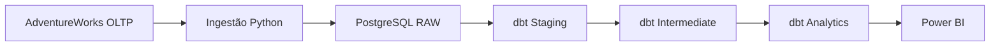
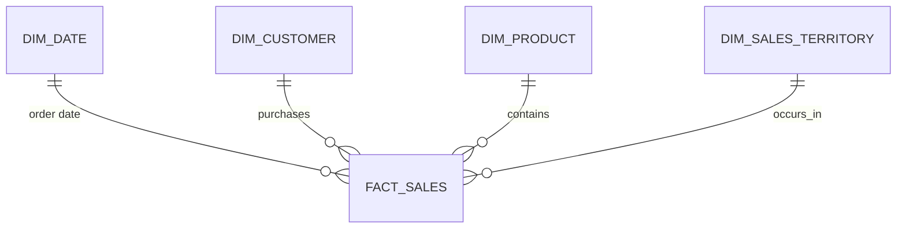

# Modern Data Platform Portfolio

> Plataforma analítica de portfólio construída sobre o AdventureWorks, com práticas de Engenharia de Dados, Analytics Engineering e Business Intelligence.

## Problema de negócio

A Adventure Works possui relatórios lentos e inconsistentes, conectados
diretamente ao banco transacional. O projeto cria uma plataforma analítica
reprodutível para separar o processamento operacional do consumo de dados.

O primeiro domínio é **Vendas** e deve responder:

- Quanto a empresa vendeu por mês?
- Quais produtos e categorias geram mais receita?
- Quem são os principais clientes?
- Qual é o ticket médio?
- Como as vendas variam por território?
- Qual é a margem bruta por produto?

## Arquitetura do MVP



Airflow, cargas incrementais e fontes adicionais entram depois que o fluxo
manual de ponta a ponta estiver funcionando.

## Estado atual

### Sprint 1 — Fundação

- [x] Estrutura inicial do repositório
- [x] PostgreSQL de origem e destino em Docker Compose
- [x] Schemas analíticos criados automaticamente
- [x] Variáveis de ambiente documentadas
- [x] Escopo do modelo dimensional de vendas
- [ ] Importar o AdventureWorks no banco de origem
- [ ] Implementar a primeira carga Python para a camada RAW

Consulte [docs/sprint-01.md](docs/sprint-01.md) para o escopo e os critérios de
aceite.

## Como executar

### Pré-requisitos

- Docker Desktop com Docker Compose
- Git

### Inicialização

1. Crie o arquivo local de configuração:

   ```bash
   cp .env.example .env
   ```

2. Suba os bancos:

   ```bash
   docker compose up -d
   ```

3. Verifique os serviços:

   ```bash
   docker compose ps
   ```

4. Valide os schemas do Data Warehouse:

   ```bash
   docker compose exec warehouse psql \
     -U analytics_user \
     -d analytics \
     -c "\dn"
   ```

Os serviços locais ficam disponíveis em:

| Serviço | Host | Porta | Banco |
| --- | --- | ---: | --- |
| AdventureWorks OLTP | `localhost` | `5433` | `adventureworks` |
| Data Warehouse | `localhost` | `5434` | `analytics` |

As credenciais de desenvolvimento estão no `.env`, que não deve ser versionado.

### Encerramento

```bash
docker compose down
```

Para remover também os volumes e reiniciar os bancos do zero:

```bash
docker compose down -v
```

## Modelo dimensional inicial



O grão da `fact_sales` será **um item de um pedido de venda**. A seleção das
tabelas de origem está documentada em
[docs/source-to-target.md](docs/source-to-target.md).

## Estrutura

```text
.
├── database/
│   └── init/
├── dbt/
├── docs/
├── ingestion/
├── powerbi/
├── tests/
├── .env.example
├── .gitignore
├── docker-compose.yml
└── README.md
```

## Roadmap

1. Fundação e importação do AdventureWorks
2. Ingestão Python completa para RAW
3. Modelos e testes dbt
4. Dashboard comercial no Power BI
5. Carga incremental e simulador de dados
6. Orquestração com Airflow
7. Novas fontes: metas, orçamento e câmbio
8. Observabilidade e documentação final

## Stack

PostgreSQL, Python, dbt, Docker Compose, Git, Apache Airflow e Power BI.
