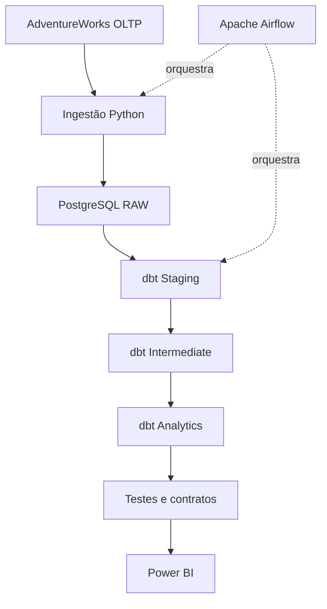
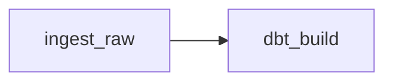
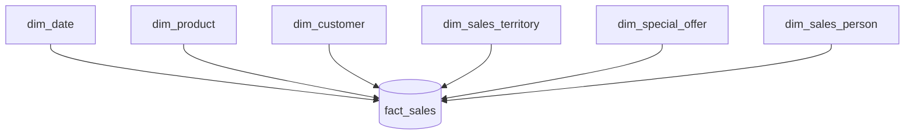

# Modern Data Platform — Adventure Works

Plataforma analítica desenvolvida como projeto de portfólio para demonstrar, de ponta a ponta, práticas de Engenharia de Dados, Analytics Engineering e Business Intelligence.

O projeto transforma dados operacionais do Adventure Works em modelos analíticos confiáveis, documentados e preparados para consumo por ferramentas de BI.

## Visão geral

O cenário simula uma empresa que depende diretamente de um banco transacional para produzir relatórios. Essa abordagem gera consultas lentas, métricas inconsistentes e forte dependência da estrutura operacional.

A solução proposta separa processamento operacional e consumo analítico por meio de uma plataforma que contempla:

- ingestão de dados;
- armazenamento em camada `raw`;
- transformação com dbt;
- modelagem dimensional;
- testes automatizados de dados;
- documentação e lineage;
- modelos orientados ao consumo;
- futura orquestração com Apache Airflow;
- futura visualização no Power BI.

## Estado atual

A primeira versão da camada analítica de vendas está concluída e validada.

| Entrega | Situação |
| --- | --- |
| PostgreSQL e dados do Adventure Works | Concluído |
| Camadas `staging` e `intermediate` | Concluído |
| Modelo dimensional de vendas | Concluído |
| Contratos e testes dbt | Concluído |
| Catálogo e lineage do dbt | Concluído |
| Mart de detalhes de vendas | Concluído |
| Orquestração com Airflow | Próxima etapa |
| Dashboards no Power BI | Planejado |

O último `dbt build` executou **248 recursos e validações**, sem avisos ou erros:

```text
PASS=248 WARN=0 ERROR=0 SKIP=0 TOTAL=248
```

## Arquitetura



## Stack tecnológica

| Área | Tecnologia |
| --- | --- |
| Banco de dados | PostgreSQL |
| Transformação | dbt |
| Linguagens | SQL e Python |
| Containerização | Docker e Docker Compose |
| Orquestração | Apache Airflow |
| Visualização | Power BI |
| Versionamento | Git e GitHub |
| Documentação | Markdown, Mermaid e dbt Docs |

# Orquestração com Apache Airflow

O Apache Airflow coordena a execução do pipeline por meio da DAG `adventureworks_pipeline`.

O fluxo possui duas tarefas:



- `ingest_raw`: executa o script Python responsável pela carga da camada RAW;
- `dbt_build`: constrói os modelos dbt e executa os testes de qualidade;
- a segunda tarefa somente começa quando a ingestão termina com sucesso;
- novas tentativas são executadas automaticamente em caso de falha.

Inicialmente, a DAG utiliza execução manual (`schedule=None`) para facilitar a validação do pipeline.

## Componentes do Airflow

A infraestrutura utiliza:

- API Server e interface web;
- Scheduler;
- DAG Processor;
- LocalExecutor;
- PostgreSQL exclusivo para metadados;
- Docker Compose para execução local.

## Executando o pipeline

Construa as imagens:

```bash
docker compose build
```

Inicialize o banco de metadados e o usuário administrador:

```bash
docker compose up airflow-init
```

Suba os serviços:

```bash
docker compose up -d
```

A interface estará disponível em:

```text
http://localhost:8080
```

Credenciais locais de desenvolvimento:

```text
Usuário: airflow
Senha: airflow
```

Na interface, ative e execute a DAG `adventureworks_pipeline`.

## Estrutura do projeto

```text
modern-data-platform/
├── airflow/                  # DAGs e configurações de orquestração
├── database/                 # Scripts e recursos do banco de dados
├── dbt/
│   └── adventure_works/
│       ├── models/
│       │   ├── staging/      # Padronização das fontes
│       │   ├── intermediate/ # Regras e combinações reutilizáveis
│       │   └── analytics/    # Fatos, dimensões e marts
│       └── tests/            # Testes singulares de negócio
├── docker/                   # Recursos de containerização
├── docs/                     # Documentação complementar
├── powerbi/                  # Artefatos do Power BI
├── python/                   # Ingestão e simulação de dados
├── docker-compose.yml
└── README.md
```

> A estrutura pode evoluir conforme as próximas etapas forem implementadas.

## Camadas de transformação

### Staging

A camada `staging` cria uma interface padronizada sobre as tabelas de origem. Nela são realizados ajustes como:

- renomeação de colunas;
- conversão de tipos;
- padronização de valores;
- inclusão de metadados de carga;
- testes básicos de qualidade.

Os modelos usam o prefixo `stg_` e são materializados como `view`.

### Intermediate

A camada `intermediate` concentra transformações reutilizáveis e combinações que não devem ficar diretamente nas dimensões ou fatos.

Os modelos usam o prefixo `int_` e são materializados como `view`.

### Analytics

A camada `analytics` representa a interface confiável para consumo por ferramentas de BI, aplicações e, futuramente, agentes de IA.

Ela contém:

- dimensões, identificadas por `dim_`;
- tabelas fato, identificadas por `fact_`;
- modelos de consumo, identificados por `mart_`.

## Modelo dimensional de vendas

O modelo segue o padrão Star Schema. A `fact_sales` possui o grão de **uma linha por item do pedido** e se relaciona com seis dimensões.



### Tabela fato

`fact_sales` concentra os eventos e as métricas de venda, incluindo:

- identificadores do pedido e do item;
- chaves para as dimensões;
- datas do pedido, vencimento e envio;
- quantidade;
- preço unitário;
- desconto;
- valor bruto;
- valor líquido;
- status e canal da venda.

Os identificadores dimensionais permanecem na fato porque garantem relacionamentos confiáveis e evitam duplicação de atributos descritivos.

### Dimensões

| Modelo | Conteúdo principal |
| --- | --- |
| `dim_date` | Calendário e atributos temporais |
| `dim_product` | Produto, classificação, características e preços de referência |
| `dim_customer` | Cliente, pessoa, loja e tipo de cliente |
| `dim_sales_territory` | Território, país ou região e grupo geográfico |
| `dim_special_offer` | Oferta, categoria, tipo, período e desconto |
| `dim_sales_person` | Vendedor, cargo, vínculo, meta, bônus e comissão |

## Mart de consumo

O modelo `mart_sales_details` oferece uma interface amigável para exploração e consumo direto.

Ele mantém o mesmo grão da `fact_sales` — **uma linha por item do pedido** — e enriquece cada registro com atributos legíveis das dimensões, como:

- nome e características do produto;
- nome e tipo do cliente;
- nome e cargo do vendedor;
- território comercial;
- descrição e classificação da oferta especial;
- métricas financeiras do item vendido.

A fato continua sendo a base técnica do modelo estrela. O mart resolve a usabilidade para consumidores que não precisam trabalhar diretamente com chaves dimensionais.

Como apenas combina modelos já persistidos, `mart_sales_details` é materializado como `view`.

## Convenção de nomenclatura

Os nomes dos modelos indicam sua responsabilidade:

| Prefixo | Responsabilidade | Exemplo |
| --- | --- | --- |
| `stg_` | Padronização direta de uma fonte | `stg_product` |
| `int_` | Transformação intermediária reutilizável | `int_sales_order_items` |
| `dim_` | Atributos descritivos de uma entidade | `dim_product` |
| `fact_` | Eventos, métricas e chaves dimensionais | `fact_sales` |
| `mart_` | Modelo preparado para consumo | `mart_sales_details` |

Um modelo `mart_` pode ser materializado como `view` quando apenas consulta modelos já persistidos e não precisa armazenar dados próprios.

## Padrões da camada analytics

Por padrão, fatos e dimensões da camada `analytics` devem possuir:

- materialização como `table`;
- contrato com `contract.enforced: true`;
- declaração de todas as colunas e seus `data_type` no YAML;
- descrição do modelo com o grão explícito;
- descrição de todas as colunas;
- chaves primárias e estrangeiras declaradas por `constraints`;
- testes que validem as regras documentadas.

Marts são uma exceção consciente à materialização padrão e podem usar `view` quando essa escolha evitar persistência desnecessária.

Exemplo da configuração-base:

```yaml
models:
  adventure_works:
    staging:
      +materialized: view

    intermediate:
      +materialized: view

    analytics:
      +materialized: table
      +contract:
        enforced: true
```

O contrato garante que as colunas e os tipos produzidos pelo SQL correspondam ao YAML. O preenchimento de `description`, entretanto, não se torna obrigatório apenas com `contract.enforced`; essa regra poderá ser adicionada futuramente ao processo de CI.

---

# Design e Prototipação

A camada de visualização foi planejada antes da implementação no Power BI, com o objetivo de garantir consistência visual, clareza e facilidade de uso.

O processo adotado contempla:

- definição do design system;
- prototipação da interface no Figma;
- implementação dos componentes funcionais no Power BI;
- versionamento do projeto no formato PBIP.

As regras de cores, tipografia, espaçamento, componentes e visualização de dados estão documentadas no [Design System](docs/design-system.md).

---


## Chaves e relacionamentos

O projeto combina três recursos do dbt:

- `ref()` registra dependências e constrói o lineage;
- `constraints` documenta chaves e obrigatoriedade nos metadados;
- `unique`, `not_null` e `relationships` validam os dados durante a execução.

Exemplo de chave primária:

```yaml
- name: product_id
  description: Identificador único do produto. Chave primária da dimensão.
  data_type: integer
  constraints:
    - type: not_null
    - type: primary_key
  data_tests:
    - not_null
    - unique
```

Exemplo de chave estrangeira:

```yaml
- name: product_id
  description: Identificador do produto vendido. Chave estrangeira para dim_product.
  data_type: integer
  constraints:
    - type: not_null
    - type: foreign_key
      to: ref('dim_product')
      to_columns: [product_id]
  data_tests:
    - not_null
    - relationships:
        arguments:
          to: ref('dim_product')
          field: product_id
```

Uma chave estrangeira só é declarada quando o modelo de destino já existe. Em campos opcionais, como o vendedor de uma venda online, não é aplicado `not_null`; o teste `relationships` valida apenas os valores preenchidos.

## Qualidade dos dados

A qualidade é verificada em diferentes níveis:

- integridade de chaves com `unique`, `not_null` e `relationships`;
- domínios válidos com `accepted_values`;
- contratos de nomes e tipos;
- detecção de duplicidades;
- coerência de datas, quantidades e descontos;
- reconciliação de valores financeiros;
- regras específicas do negócio.

### Padrão dos testes singulares do dbt

Os testes singulares ficam no diretório `tests/` e são consultas SQL que retornam exclusivamente registros inválidos. O teste passa quando a consulta retorna zero linhas.

Cada teste singular deve:

- começar com um comentário que explique quais registros são retornados;
- registrar regras relacionadas deliberadamente excluídas enquanto ainda não forem confirmadas pelo negócio;
- selecionar o identificador e as colunas necessárias para investigar a falha;
- declarar explicitamente a condição de invalidez na cláusula `where`;
- possuir um nome que descreva a regra validada.

Exemplo:

```sql
-- Retorna itens cujo valor líquido difere do valor bruto menos o desconto.

select
    sales_order_detail_id,
    gross_amount,
    discount_amount,
    net_amount
from {{ ref('fact_sales') }}
where abs(net_amount - (gross_amount - discount_amount)) > 0.01
```

As regras de qualidade e a forma de investigação das falhas também são registradas no catálogo de qualidade do projeto.

## Documentação e lineage

Os modelos, colunas, testes e relacionamentos estão documentados em arquivos YAML. O catálogo navegável e o grafo de dependências são gerados pelo dbt:

```bash
conda run -n adventure-dbt dbt docs generate
conda run -n adventure-dbt dbt docs serve
```

O lineage permite acompanhar o fluxo desde as fontes operacionais, passando pelas camadas `staging` e `intermediate`, até a `fact_sales`, suas dimensões e o `mart_sales_details`.

## Como executar

Na raiz do projeto dbt:

```bash
cd dbt/adventure_works
```

Validar a sintaxe e as dependências:

```bash
conda run -n adventure-dbt dbt parse
```

Executar todos os modelos e testes na ordem de dependência:

```bash
conda run -n adventure-dbt dbt build
```

Consultar uma amostra do mart:

```bash
conda run -n adventure-dbt dbt show --select mart_sales_details --limit 10
```

Gerar a documentação:

```bash
conda run -n adventure-dbt dbt docs generate
conda run -n adventure-dbt dbt docs serve
```

Para encerrar o servidor local da documentação, pressione `Ctrl + C` no terminal.

## Roadmap

| Etapa | Escopo | Status |
| --- | --- | --- |
| 1. Infraestrutura | PostgreSQL, Docker, Git e Adventure Works | Concluído |
| 2. Base de transformação | Sources, staging e intermediate | Concluído |
| 3. Data Warehouse | Star Schema, fato e dimensões | Concluído |
| 4. Qualidade e consumo | Contratos, testes, documentação e mart | Concluído |
| 5. Orquestração | DAG, scheduler, retries, logs e alertas | Próxima etapa |
| 6. Business Intelligence | Modelo semântico e dashboards no Power BI | Planejado |
| 7. Evolução das cargas | Ingestão incremental e simulação de novos eventos | Planejado |

## Próxima etapa

A próxima entrega é orquestrar a execução da plataforma com Apache Airflow. A primeira DAG deverá:

1. validar a disponibilidade das fontes;
2. executar a ingestão;
3. executar o `dbt build`;
4. registrar duração e status das tarefas;
5. permitir retries controlados;
6. preparar alertas para falhas.

## Evoluções futuras

- dashboards executivo, comercial, de produtos e de clientes;
- cargas incrementais e snapshots;
- simulador em Python para novos pedidos e clientes;
- integração de metas comerciais em CSV;
- integração de orçamento em Excel;
- integração de cotação de moedas via API;
- CI/CD com GitHub Actions;
- observabilidade de volume, duração e falhas;
- catálogo de dados;
- deploy em nuvem;
- avaliação de CDC, Kafka, MinIO, DuckDB, Snowflake e Terraform.

## Decisões arquiteturais

### ADR-001 — PostgreSQL como banco da plataforma

O PostgreSQL foi escolhido por ser open source, possuir integração madura com dbt e Airflow e oferecer execução simples em containers.

### ADR-002 — Separação entre fato e mart de consumo

A `fact_sales` preserva chaves dimensionais e métricas no modelo estrela. O `mart_sales_details` fornece nomes e atributos descritivos para consumo direto, sem desnormalizar ou substituir a fato.

### ADR-003 — Contratos na camada analytics

Fatos e dimensões utilizam contratos para garantir compatibilidade entre o SQL produzido e a estrutura declarada no YAML.

## Objetivo profissional

Este projeto foi criado para demonstrar competências relevantes para posições de:

- Data Analyst;
- BI Engineer;
- Analytics Engineer;
- Data Engineer.

As decisões técnicas priorizam simplicidade, qualidade, documentação, reprodutibilidade e clareza para o negócio.
