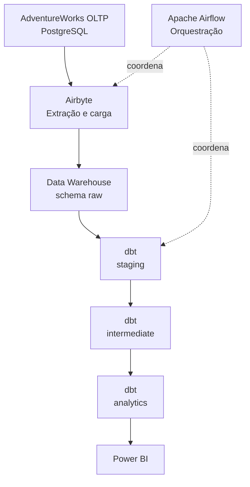

# Modern Data Platform Portfolio

> Projeto de portfólio para construção de uma plataforma analítica moderna, utilizando boas práticas de Engenharia de Dados, Analytics Engineering e Business Intelligence.

---

# Visão do projeto

O objetivo não é apenas construir um dashboard.

O projeto simula a implantação de uma plataforma de dados em uma empresa real, com arquitetura, documentação e padrões utilizados por equipes de dados.

---

# Objetivos

Demonstrar experiência prática em:

- SQL;
- PostgreSQL;
- Airbyte;
- Python;
- Docker e Docker Compose;
- Git e GitHub;
- dbt;
- Apache Airflow;
- Data Warehouse;
- modelagem dimensional;
- testes e qualidade de dados;
- observabilidade;
- Power BI.

---

# Objetivo profissional

Este projeto será o principal item do portfólio para vagas de:

- Data Analyst;
- BI Engineer;
- Analytics Engineer;
- Data Engineer.

Toda decisão técnica deve priorizar:

- simplicidade;
- boas práticas;
- escalabilidade;
- documentação;
- reprodutibilidade.

---

# Cenário

Uma empresa fictícia chamada **Adventure Works** possui apenas um banco operacional.

Os relatórios são lentos, inconsistentes e dependem diretamente do banco transacional. Para resolver esse problema, foi iniciado um projeto de modernização da plataforma analítica.

Nossa missão é construir essa plataforma de ponta a ponta.

---

# Escopo

O projeto contempla:

- banco de dados operacional;
- ingestão e replicação de dados;
- camada `raw`;
- camada `staging`;
- camada `intermediate`;
- camada `analytics`;
- Data Warehouse dimensional;
- testes de dados;
- orquestração;
- observabilidade;
- dashboards;
- documentação;
- versionamento no GitHub.

---

# Arquitetura



## Responsabilidades

| Componente | Responsabilidade |
| --- | --- |
| AdventureWorks OLTP | Representar o banco transacional da empresa |
| Airbyte | Extrair os dados da origem e carregá-los no schema `raw` |
| PostgreSQL | Hospedar a origem transacional e o Data Warehouse |
| dbt | Transformar os dados dentro do warehouse e construir as camadas analíticas |
| Apache Airflow | Orquestrar ingestões, transformações, testes e demais tarefas do pipeline |
| Power BI | Consumir os modelos do schema `analytics` |
| Python | Simular alterações na origem e atender integrações específicas quando necessário |

> O dbt não transporta os dados da origem para o Data Warehouse. Ele executa transformações dentro do warehouse, a partir dos dados carregados pelo Airbyte no schema `raw`.

---

# Camadas de dados

## `raw`

Dados replicados pelo Airbyte com mínima transformação, preservando a estrutura e os valores da origem.

## `staging`

Modelos dbt responsáveis por:

- renomear colunas;
- corrigir tipos;
- padronizar valores;
- realizar limpezas básicas;
- preparar cada entidade para reutilização.

## `intermediate`

Modelos dbt reutilizáveis que concentram:

- junções;
- regras de negócio;
- enriquecimentos;
- cálculos intermediários.

## `analytics`

Camada de consumo com fatos, dimensões e métricas confiáveis para análise e Power BI.

---

# Evolução do projeto

O AdventureWorks é um banco estático. Para aproximar o projeto de um ambiente corporativo, serão implementados simuladores de atualização.

Scripts Python serão responsáveis por:

- gerar novos pedidos;
- criar novos clientes;
- atualizar estoque;
- alterar preços;
- registrar devoluções;
- registrar cancelamentos.

Esses scripts alterarão o banco transacional. Em seguida, o Airbyte replicará as mudanças para o schema `raw`, permitindo a implementação de cargas incrementais.

```text
Python simula eventos → AdventureWorks OLTP → Airbyte → raw → dbt → analytics
```

---

# Fontes de dados

## Fonte 1 — AdventureWorks

- Tipo: banco relacional PostgreSQL;
- Papel: ERP e principal origem transacional;
- Ingestão: Airbyte.

## Fonte 2 — CSV

- Exemplo: metas comerciais.

## Fonte 3 — Excel

- Exemplo: orçamento.

## Fonte 4 — API

- Exemplo: cotação de moedas.

## Fonte 5 — Dados sintéticos

- Gerados por Python para simular movimentações diárias no banco operacional.

---

# Stack tecnológica

| Categoria | Tecnologia |
| --- | --- |
| Banco de dados | PostgreSQL |
| Ingestão e replicação | Airbyte |
| Linguagem | Python |
| Analytics Engineering | dbt |
| Orquestração | Apache Airflow |
| Containerização | Docker e Docker Compose |
| Versionamento | Git e GitHub |
| Visualização | Power BI |
| Documentação | Markdown e Mermaid |

---

# Estrutura do repositório

```text
modern-data-platform/
├── airflow/
├── database/
├── dbt/
├── docs/
├── ingestion/
├── powerbi/
├── tests/
├── docker-compose.yml
├── .env.example
└── README.md
```

O diretório `ingestion/` será reservado para configurações, scripts auxiliares e documentação de ingestão. A replicação principal entre os bancos será realizada pelo Airbyte.

---

# Ambiente local

O ambiente inicial possui dois containers PostgreSQL:

| Serviço | Banco | Porta local | Finalidade |
| --- | --- | ---: | --- |
| `source` | `adventureworks` | `5433` | Banco transacional |
| `warehouse` | `analytics` | `5434` | Data Warehouse |

O warehouse contém os schemas:

- `raw`;
- `staging`;
- `intermediate`;
- `analytics`.

---

# Roadmap

## Sprint 1 — Infraestrutura e origem

- [x] Criar o repositório;
- [x] configurar Docker Compose;
- [x] criar PostgreSQL de origem;
- [x] criar PostgreSQL para o warehouse;
- [x] criar os schemas analíticos;
- [x] importar o AdventureWorks;
- [x] validar tabelas e registros principais.

## Sprint 2 — Ingestão

- [ ] adicionar o Airbyte ao ambiente;
- [ ] configurar a origem PostgreSQL;
- [ ] configurar o destino PostgreSQL;
- [ ] replicar as primeiras tabelas para o schema `raw`;
- [ ] validar carga completa;
- [ ] definir estratégia incremental.

## Sprint 3 — Transformações com dbt

- [ ] configurar o projeto dbt;
- [ ] declarar as fontes do schema `raw`;
- [ ] construir modelos `staging`;
- [ ] construir modelos `intermediate`;
- [ ] criar fatos e dimensões em `analytics`;
- [ ] implementar testes e documentação.

## Sprint 4 — Orquestração e observabilidade

- [ ] configurar o Apache Airflow;
- [ ] orquestrar Airbyte e dbt;
- [ ] adicionar testes ao fluxo;
- [ ] implementar logs, alertas e monitoramento.

## Sprint 5 — Business Intelligence

- [ ] conectar o Power BI ao schema `analytics`;
- [ ] criar o modelo semântico;
- [ ] desenvolver dashboards;
- [ ] documentar métricas e decisões analíticas.

---

# Status atual

A infraestrutura local e o banco transacional estão prontos. O AdventureWorks foi importado com **68 tabelas**, distribuídas nos schemas:

- `humanresources`;
- `person`;
- `production`;
- `purchasing`;
- `sales`.

O próximo passo é configurar o Airbyte para replicar os dados do banco `source` para o schema `raw` do warehouse.
